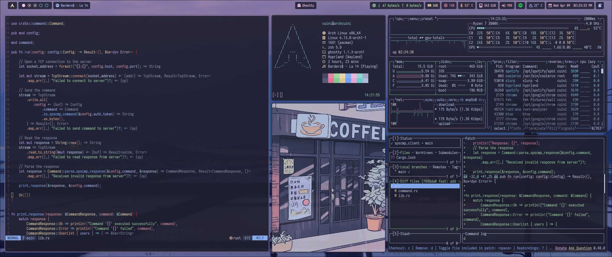
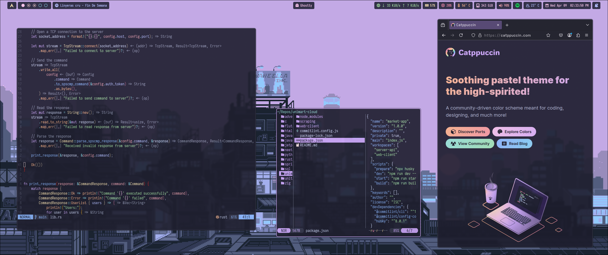
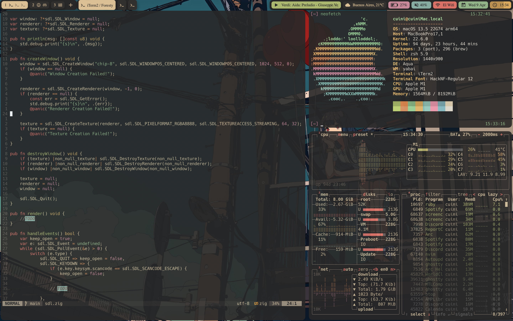

# dotfiles

Personal configurations for my development environment both for `macOS` and `arch`.

## Arch (catpuccin themed)

## Mac (gruvbox themed)

## Considerations

For `hyprpanel` weather module a [weatherapi](https://www.weatherapi.com/) api key is needed. See [here](https://www.weatherapi.com/). 
The current config expects one in the `hyprpanel` config directory.

## Credits

- [gh0stzk/dotfiles](https://github.com/gh0stzk/dotfiles) (old bspwm config)
- [LierB/fastfetch](https://github.com/LierB/fastfetch) (arch fetch preset)
- [mac rice](https://www.reddit.com/r/unixporn/comments/jupmda/aquayabai_a_fun_colorful_rice_to_brighten_my/) (mac rice inspiration)
- [adi1090x/rofi](https://github.com/adi1090x/rofi?tab=readme-ov-file) (rofi theme inspiration)
